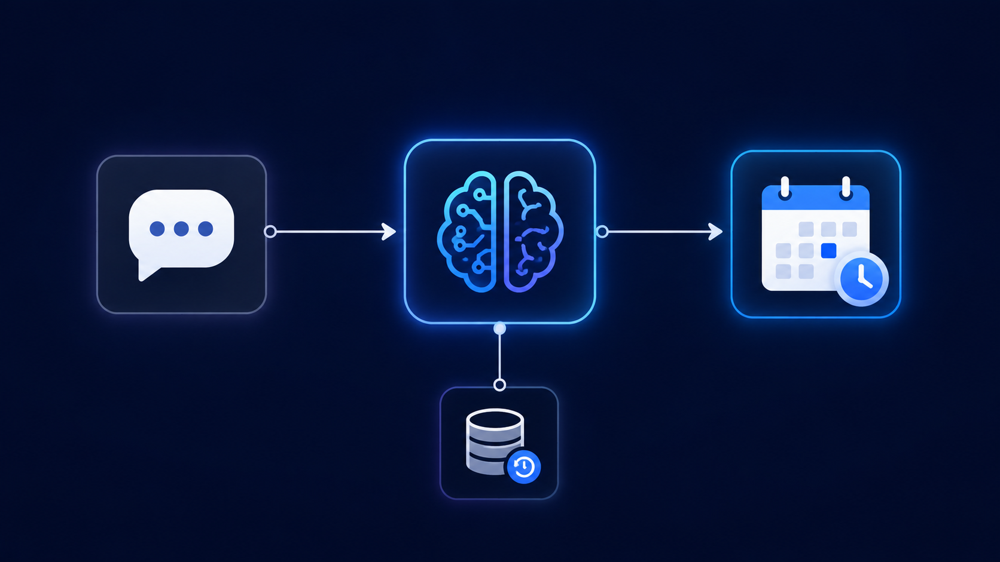

# Calendar Booking Agent

A conversational AI agent that converts natural language requests like "block tomorrow at 2 PM" into structured Google Calendar events. No forms, no dropdowns — just a chat message and the event gets created.

## The problem this solves

Booking a calendar event the normal way means opening Google Calendar, clicking the right date, filling in a title and time, and saving. This workflow collapses that into a single sentence typed into a chat window — the AI agent figures out what event to create and when, and books it directly.

## How it works

1. **Chat trigger** — A public chat interface greets the user and waits for a scheduling request
2. **AI Agent** — Given the current date and time as context, the agent interprets the natural language request and decides what calendar action is needed
3. **Memory (buffer window)** — Keeps the last 10 messages of context so the agent can handle follow-up clarifications in the same conversation
4. **Create New Events (Google Calendar tool)** — The agent calls this tool with a structured start time, end time, and event summary extracted from the natural language input, and the event is created directly on the connected Google Calendar

## What I actually built (not just configured)

The core of this workflow is the system prompt that defines the agent's role and constrains it to only use the calendar tools available, plus making sure the agent has access to the actual current date/time so relative phrases like "tomorrow" resolve correctly. The Google Calendar tool's start/end/summary fields are wired to be filled in by the AI agent dynamically (via `$fromAI`) rather than hardcoded, which is what makes the natural-language-to-structured-event conversion actually work.

## Tools used

n8n · OpenAI API (gpt-5-mini) · Google Calendar API · LangChain Agent node · Memory Buffer Window

## Workflow file

[`Book_An_Event_In_Calendar.json`](./Book_An_Event_In_Calendar.json) — import directly into n8n to see the full node graph.
