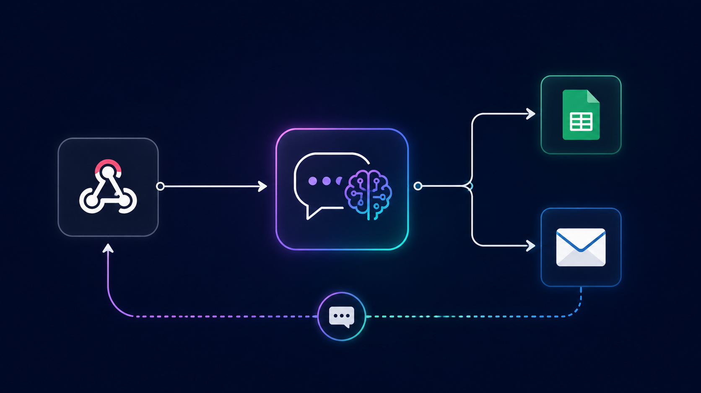

# Developer Portfolio Query Bot

An AI-powered query handler built to sit behind a portfolio site or chatbot. It receives a question via webhook, answers technical questions in a clear, human-like way using an AI model, logs every query to a spreadsheet, sends the asker a follow-up email with the answer, and responds to the original request — all in one automated flow.

## The problem this solves

A portfolio site that just shows static project links doesn't let visitors actually ask questions. This workflow turns a portfolio into something interactive: a visitor can ask a technical question and get a real, useful answer immediately, while every interaction is logged and the asker also gets a written record by email.

It also handles the "wrong kind of question" gracefully — if someone asks something non-technical, or if they're actually trying to offer a job, a collaboration, or a client opportunity, the AI is instructed to redirect them to reach out directly instead of trying to answer on its own.

## How it works

1. **Webhook trigger** — Receives a POST request with `name`, `email`, `mobile`, and `query` fields
2. **Log to Google Sheets** — Every incoming query is appended to a "Query Datasets" sheet before anything else happens, so nothing is lost even if a later step fails
3. **AI response (OpenAI)** — The model is given a system prompt instructing it to:
   - Act like a technical mentor for data science, ML, GenAI, and prompting questions
   - Answer technical questions with plain, relatable analogies
   - Reply "I'm Not The Right Person For This" and provide direct contact details for anything non-technical
   - Specifically detect collaboration, client, or job-opportunity language and redirect those people to contact me directly rather than letting the AI try to handle them
4. **Email follow-up** — Sends the asker a personalized email containing their original question and the AI's response
5. **Webhook response** — Returns the AI's answer directly to whatever called the webhook (e.g., a chat widget on a website)

## What I actually built (not just configured)

The system prompt encodes specific business rules, not generic chatbot behavior: it has to recognize the difference between "explain X to me" and "I want to hire you," and route those completely differently. I also chained the webhook response to pull from the AI node's output structure (`output[0].content[0].text`), and made sure the Google Sheets log happens before the AI call so every interaction is captured regardless of what happens downstream.

## Tools used

n8n · OpenAI API · Google Sheets API · Gmail API · Webhook (HTTP trigger/response)

## Workflow file

[`Developer_Portfolio_Query.json`](./Developer_Portfolio_Query.json) — import directly into n8n to see the full node graph.
