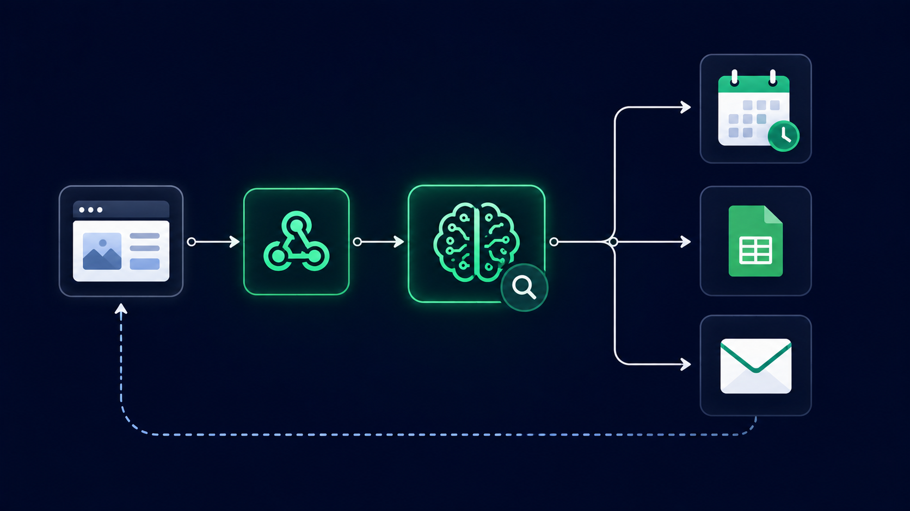

# Physio Appointment — Lovable Webhook Version

A non-conversational version of the clinic booking system, redesigned to power a custom website built with Lovable. Instead of chatting with the patient turn by turn, this version receives one complete webhook request and has to process, decide, and book entirely on its own — no follow-up questions allowed.

## How it works

1. **Webhook trigger** — Receives a POST request from a website form (built in Lovable) containing the patient's Full Name, Age, Gender, Contact Number, Email, Health Issue, Preferred Appointment Date, and Preferred Appointment Time (in any human-readable format)
2. **No user interaction** — The agent is explicitly instructed not to ask questions or wait for confirmation; it has exactly one shot to get this right
3. **Normalize input** — Parses the freeform date/time into a structured format
4. **Fetch the last patient ID** — A dedicated lookup step finds the most recent patient ID in the spreadsheet so the new one can be generated correctly without duplicating or skipping a number
5. **Check availability & auto-select slot** — Checks the calendar against the same clinic rules as the chat version, then automatically picks the best available slot — no human to confirm with
6. **Book event** — Creates the calendar event directly
7. **Store data** — Logs both patient and appointment details to Google Sheets
8. **Send confirmation email** — Same structured email format as the other versions
9. **Respond to webhook** — Returns a simple success response so the website knows the booking completed

## What I actually built (not just configured)

This version required solving a problem the chat version didn't have: how do you generate a sequential, non-duplicating patient ID when there's no conversation memory to hold it across turns? I added a dedicated "Fetch The Last Patient ID" read step specifically to solve this — the agent looks up the actual last-used ID from the spreadsheet before generating the next one, since a single webhook call has no prior context to rely on. I also wrote the system prompt to explicitly forbid any conversational behavior (no follow-up questions, no confirmations) since the website calling this webhook expects exactly one response, not a back-and-forth.

## Tools used

n8n · OpenAI API · Google Calendar API · Google Sheets API · Gmail API · Webhook (HTTP trigger/response) · Lovable (frontend)

## Workflow file

[`Physio_Appointment_Lovable.json`](./Physio_Appointment_Lovable.json) — import directly into n8n to see the full node graph.
