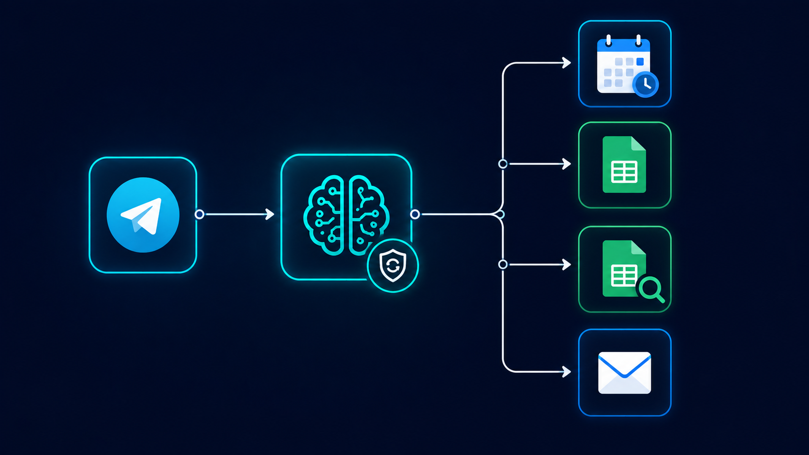

# Physio Appointment — Telegram Version (OpenAI)

The clinic booking system rebuilt for Telegram, where patients can book an appointment directly through a Telegram bot conversation. This version also adds lookup tools so returning patients can check their own details and appointment history, and introduces anti-loop safety logic that the earlier versions didn't need.

## How it works

1. **Telegram trigger** — Fires only on new messages from a real human user — explicitly never on messages the bot sent itself
2. **First-message greeting** — On the very first message in a conversation, the bot sends a fixed welcome message and stops immediately, without asking questions or calling any other tools, then waits for the next message
3. **Anti-loop safety check** — Before doing anything else, the agent checks whether the last message in the conversation came from the assistant itself; if so, it does not respond again, preventing an infinite reply loop
4. **Booking flow** — Same core logic as the web chat version: collect patient details, generate a patient ID, check availability against clinic rules, confirm a slot, book it, log it, and email a confirmation
5. **Returning patient lookups** — New tools ("Find Patient Details" and "Find Patient Appointment Details") let the agent look up an existing patient's records instead of re-registering them from scratch
6. **Response delivery** — All replies are sent back through a dedicated Telegram response tool rather than a generic chat output

## What I actually built (not just configured)

The anti-loop safety rule is the key addition here, and it's not something n8n or Telegram handles automatically — a bot that replies to every incoming message can end up replying to its own messages if the trigger isn't filtered correctly, creating a runaway loop. I wrote explicit logic into the system prompt to check who sent the last message before deciding whether to respond at all. I also added the two patient-lookup tools so the system could handle returning patients without re-collecting information it already has, which the original chat version didn't support.

## Tools used

n8n · OpenAI API · Google Calendar API · Google Sheets API · Telegram Bot API · LangChain Agent · Memory Buffer Window

## Workflow file

[`Physio_Appointment_With_Telegram.json`](./Physio_Appointment_With_Telegram.json) — import directly into n8n to see the full node graph.
