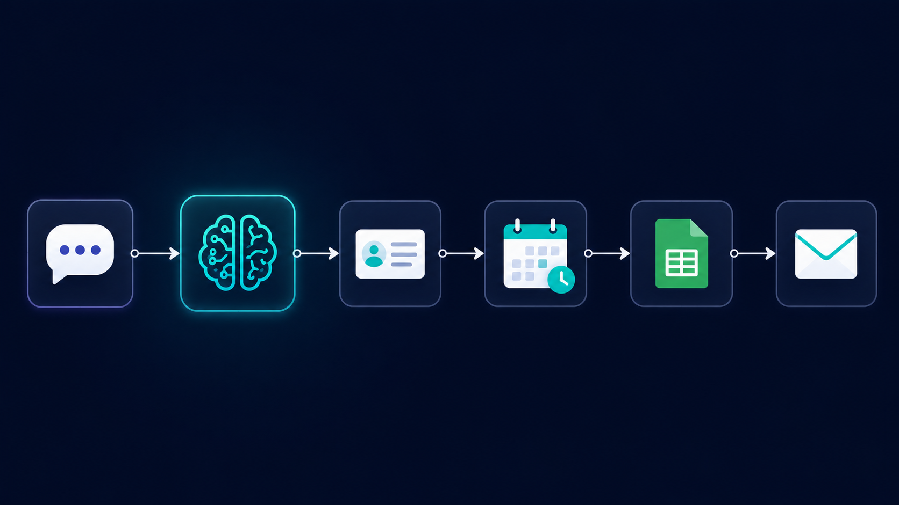

# Physio Appointment — Web Chat Version

The original version of the clinic appointment booking system, built around a conversational chat interface. The AI agent talks directly to the patient, collecting details one at a time, checking availability, and confirming the slot before booking — like a real receptionist conversation.

## How it works

1. **Chat trigger** — Patient opens a chat window and is greeted by the AI receptionist
2. **Patient registration** — The agent collects, one at a time: Full Name, Age, Gender, Mobile Number, Email, Health Issue, Preferred Appointment Date
3. **Patient ID generation** — Once all details are collected, the agent generates a patient ID in the format `PAT-YYYYMMDD-XXX` (based on registration date, sequential per day) and holds it in conversation memory — never regenerated, never re-read from the spreadsheet
4. **Store patient details** — Calls "Add Patient Details" exactly once to log the patient to the master table
5. **Slot checking** — Calls "Get Details Of Another Events" to check the calendar against clinic rules (9 AM–5 PM, 30-minute slots, no 1–2 PM, no weekends/holidays) and presents available slots in a fixed format
6. **Confirmation** — Asks the patient to confirm one specific slot before doing anything else
7. **Booking** — Creates the calendar event, then logs the appointment (patient ID, date, slot) to a separate transaction table
8. **Confirmation email** — Sends a structured email with all patient and appointment details in a fixed field order, plus a clinic note and receptionist contact info

## What I actually built (not just configured)

The patient ID generation rule, the "store once, never duplicate" execution constraints, and the exact slot-availability rules (including the 1–2 PM blackout and weekend/holiday exclusions) are all custom logic I wrote into the agent's system prompt — not default n8n behavior. I also designed the strict ordering of operations (register → ID → store → check slots → confirm → book → log → email) so that nothing fires out of sequence or repeats.

## Tools used

n8n · OpenAI API · Google Calendar API · Google Sheets API · Gmail API · LangChain Agent · Memory Buffer Window

## Workflow file

[`Physio_Appointment.json`](./Physio_Appointment.json) — import directly into n8n to see the full node graph.
