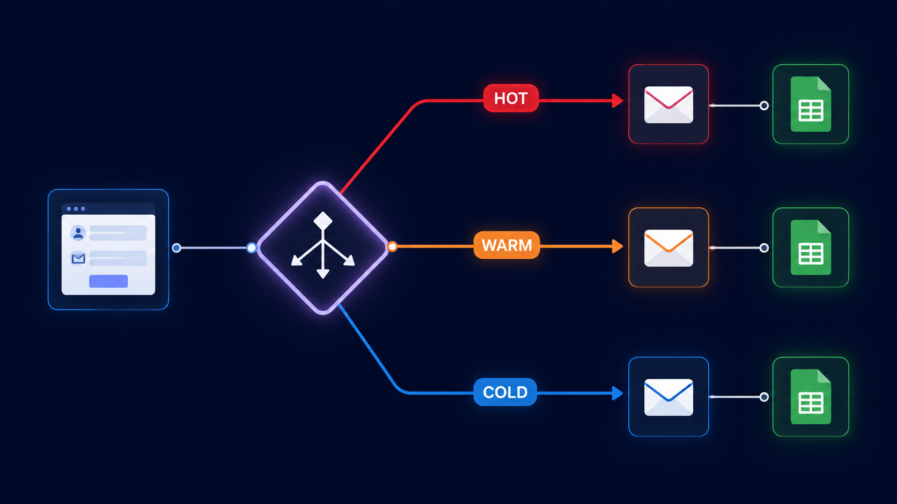

# Smart Lead Qualification System

A lead-scoring and routing automation built in n8n. When someone submits a product enquiry form, this workflow automatically classifies them as a HOT, WARM, or COLD lead based on their stated budget and urgency, logs the lead to a master spreadsheet, and triggers a different email/alert sequence depending on the classification.

## The problem this solves

Sales teams waste time treating every inbound enquiry the same way. A lead with a high budget and an immediate need should get a phone call within the hour. A lead that's "just exploring" with a low budget shouldn't trigger the same urgency. This workflow automates that triage step so the right leads get attention first — without anyone manually reading and sorting every form submission.

## How it works

1. **Form trigger** — A "Product Enquiry Form" collects Full Name, Email, Company Name, Product Interest, Budget Range (Low/Medium/High), and Urgency (Exploring/1 Week/Immediate)
2. **Timestamp** — Every submission gets a timestamp added at intake
3. **Scoring logic (JavaScript Code node)** — Custom rules classify the lead:
   - `HOT`: High budget + Immediate urgency, OR Medium budget + Immediate urgency
   - `WARM`: Medium budget (without immediate urgency)
   - `COLD`: everything else
4. **Logging** — Every lead, regardless of score, is appended to a Google Sheet with full details and its classification
5. **Routing (Switch node)** — Based on the `leadType` field, the workflow branches three ways:
   - **HOT** → sends a confirmation email to the lead AND fires an internal "🔥 HOT LEAD ALERT" email to the sales inbox with full lead details, flagged for immediate action
   - **WARM** → sends a standard confirmation email
   - **COLD** → sends a lower-urgency "we'll keep you updated" email

## What I actually built (not just configured)

The scoring logic isn't an n8n built-in feature — it's a custom JavaScript Code node I wrote that reads the form fields (including ones with spaces in their names, which required bracket notation) and applies the HOT/WARM/COLD rules. I also designed the three-way Switch branching and made sure the HOT path triggers two separate actions (lead confirmation + internal alert) instead of just one.

## Tools used

n8n · Google Sheets API · Gmail API · n8n Form Trigger · JavaScript (Code node) · Switch node (conditional routing)

## Workflow file

[`Smart_Lead_Qualification_System.json`](./Smart_Lead_Qualification_System.json) — import directly into n8n to see the full node graph.
